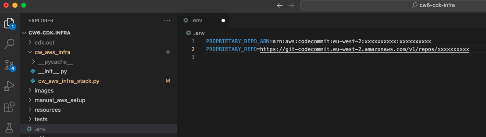
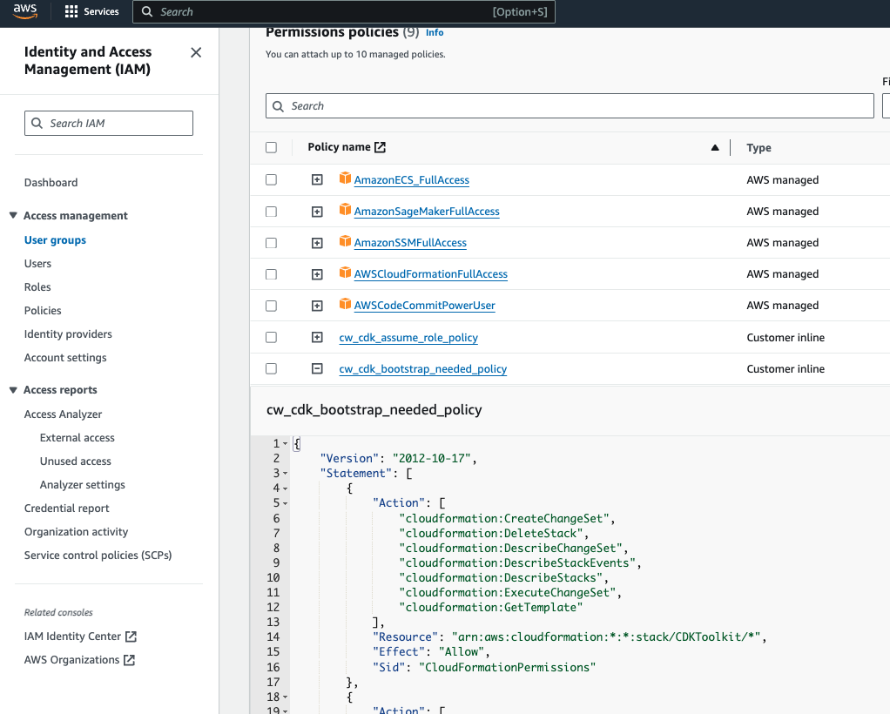
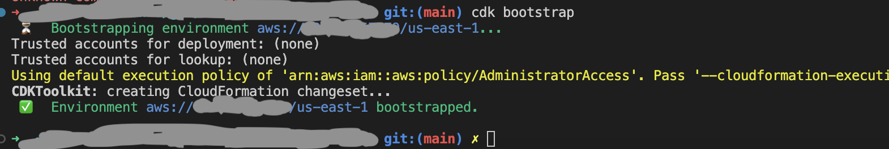
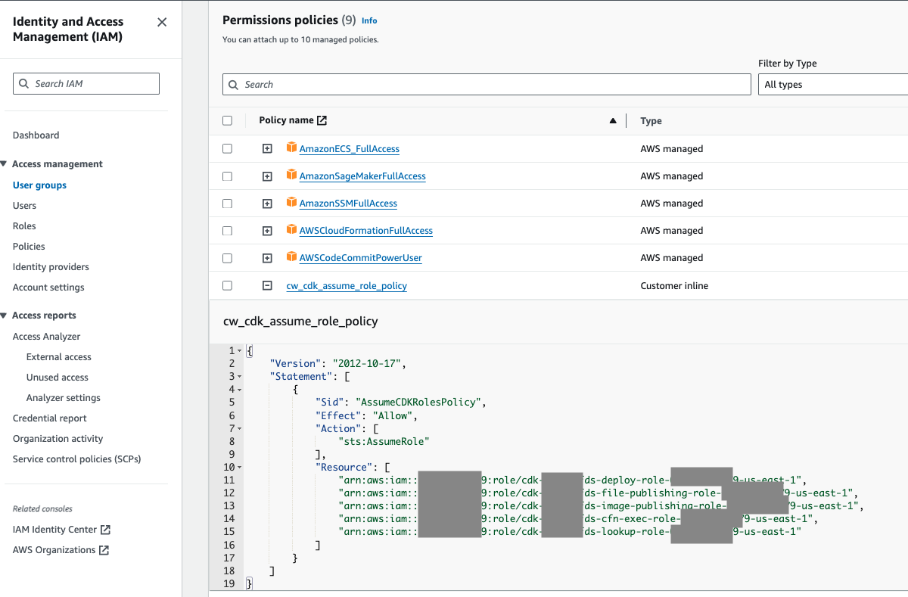

# Welcome to your CDK Python project!

>:warning: All command in this README file, should run on the root directory of this repository. 

This is a project for CDK development with Python.

The `cdk.json` file tells the CDK Toolkit how to execute your app.

This Project is set-up by command 
```
$ cdk init app --language python
```

reference:\
https://docs.aws.amazon.com/cdk/v2/guide/hello_world.html

And futher modify reference to this link\
https://stackoverflow.com/questions/72796618/can-you-manage-a-cdk-project-with-poetry

Before install the packages, it is recommended to set-up PyEnv and Poetry to manage the pythong environment\
https://dev.to/mattcale/pyenv-poetry-bffs-20k6

Install cdk cli\
https://aws.amazon.com/getting-started/guides/setup-cdk/module-two/

```
$ npm install -g aws-cdk
```


## initialize the viritual environment with poetry

```
$ poetry init
```

Install the package defined in `pyproject.toml`

```
$ poetry install
```

## Set-up .env file, add the notebook repository information (assume pulling notebook from AWS codecommit)



# CDK Deployment (assume PyEnv and Poetry have installed)

>:warning: Before runnning thw cdk command, you need to make sure your AWS user profile has enought permissions to run s AWS SSM and CloudFormation services. 

Below is the recommended list of policys to attach to user / user group
- AmazonSSMFullAccess
- AWSCloudFormationFullAccess

At this point you can now synthesize the CloudFormation template for this code.

```
$ cdk synth
```

>:warning: Bootstrapping is the process of provisioning resources for the AWS CDK before you can deploy AWS CDK apps into an AWS environment. This is prerequisite for running `cdk deploy`

## CDK Bootstrapping

Reference of CDK Bootstrapping \
https://docs.aws.amazon.com/cdk/v2/guide/bootstrapping.html \
https://github.com/aws/aws-cdk/issues/21937 \
The minimal policy JSON is inside `manual_aws_setup\cdk_bootstrap_least_privilege_permission.json`

Add the cdk_bootstrap_least_privilege_permission



Run the bootstrap command

```
$ cdk bootstrap
``` 



>:warning: After bootstrapping and set-up the IAM role, S3 bucket and CDKToolkit in CloudFormation, you need to add the assume role policy to the IAM user / user group, so that your AWS user profile can use the IAM role created by cdk bootstrappiing to deploy CloudFormation stack

Reference:\
https://stackoverflow.com/questions/34922920/how-can-i-allow-a-group-to-assume-a-role \ 
https://stackoverflow.com/questions/68275460/default-credentials-can-not-be-used-to-assume-new-style-deployment-roles \
The example policy JSON is inside `manual_aws_setup\cdk_deploy_assume_role_policy.json`



## Deploy the CDK

Deploy the stack generated by `cdk synth`
```
$ cdk deploy
```

To tear down the stack, run
```
$ cdk destroy
```

## Useful commands

To add additional dependencies, for example other CDK libraries, just run

```
# prod
poetry add <package-name>

# dev dependency
poetry add <package-name> --dev 
```


 * `cdk ls`          list all stacks in the app
 * `cdk synth`       emits the synthesized CloudFormation template
 * `cdk deploy`      deploy this stack to your default AWS account/region
 * `cdk diff`        compare deployed stack with current state
 * `cdk docs`        open CDK documentation

Enjoy!
